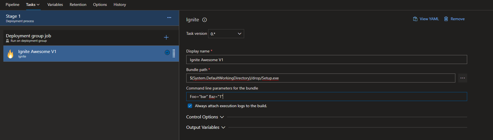

# Ignite build task

This extension contains a build task that executes an installer based on [Burn](https://wixtoolset.org/documentation/manual/v3/bundle/) and the Wix Toolset. 

It reports the bundles progress and attaches the log files generated by the setup to the current build. 

This task can be added to build and release pipelines.

## Configuration



Yaml:
```yaml
steps:
- task: HenningKrause.ignite-build-extension.ignite-task.ignite@0
  displayName: 'Ignite Awesome V1'
  inputs:
    bundlePath: '$(System.DefaultWorkingDirectory)/drop/Setup.exe'
    commandLineParameters: 'Foo="bar" Baz="1"'
    alwaysAttachLogs: true
```

* **Bundle path**: The path to the setup
* **Command Line parameters**: Additional parameters for the bundle.
* **Always attach Logs**: By default, log files are only attached if the setup fails. Tick this checkbox to always attach the log files generated by the setup.
  Note: The log files can be accessed by downloading the ZIPped logs for the run.

## Progress reporting

The task uses the Burn embedded protocol to track the progress of the execution. If you are using the standard burn bootstrapper, this should work out of the box.

When using your home-grown bootstrapper, you can use the `SendEmbeddedProgress` method. For example, if you have a managed burn bootrapper and your instance of the `BootstrapperApplication` is stored in the field `_BootStrapper`, you can use this line to report progress:

```cs
_Bootstrapper.ExecuteProgress += (sender, args) => _Bootstrapper.Engine.SendEmbeddedProgress(args.ProgressPercentage, args.OverallPercentage);
```
